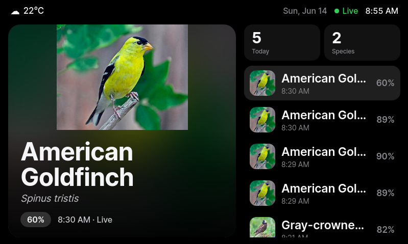
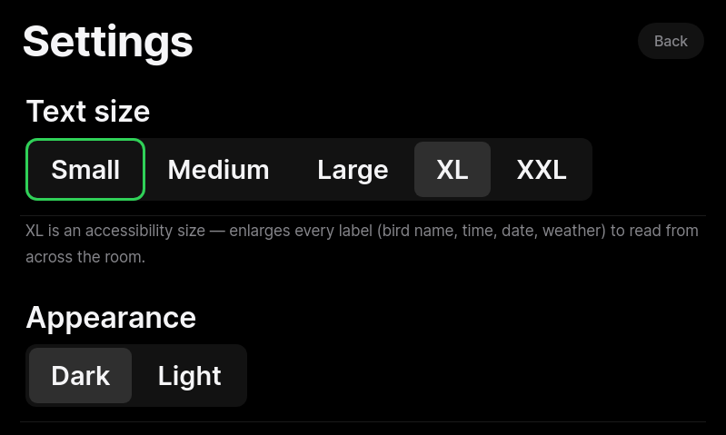
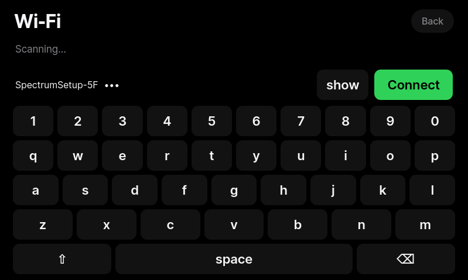
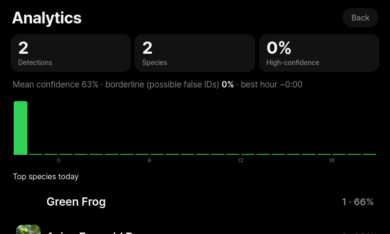
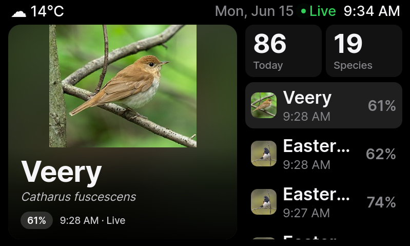

# 🐦 BirdThing

Turn a **Spotify Car Thing** into a live bird‑identification display. The Car Thing sits at a
window, listens with its **built‑in microphone**, a **Raspberry Pi** runs
[BirdNET‑Pi](https://github.com/Nachtzuster/BirdNET-Pi) to identify the birds, and the Car Thing's
800×480 screen shows a clean, Apple‑style dashboard of what's singing — with photos, facts, daily
counts, and activity graphs.

Built by **Naga**.



### More views & features

| Settings — text sizes & brightness | Wi‑Fi picker (on‑screen keyboard) |
|---|---|
|  |  |
| **Analytics** — today's volume & confidence | **Accessibility** — XL text |
|  |  |

Features: Small→XXL text sizes, auto/low/mid/high brightness, on‑screen **Wi‑Fi** switcher,
**bird‑region** + geo‑filter (precision↔catch‑all) with IP auto‑location, tap‑to‑open Wikipedia
facts with a ▶ play‑call (Xeno‑canto), nightly analytics, and a self‑healing mic.

---

## How it works

```
Car Thing PDM mic ──(capture+gain, Python/ALSA)──► TCP ──► Raspberry Pi
                                                            │  aplay → ALSA loopback
                                                            ▼
                                                     BirdNET‑Pi (arecord → analyze)
                                                            │  detections → SQLite
                                                            ▼
   Car Thing Chromium kiosk  ◄──── HTTP dashboard + API (Flask‑style, :8090) ◄──┘
```

- The Car Thing runs a tiny **Python daemon** that captures the PDM mic, auto‑gains it, and pushes
  audio to the Pi over **one TCP connection**.
- The Pi feeds that audio into an **ALSA loopback** that **BirdNET‑Pi** records and analyzes.
- A small **dashboard API** reads BirdNET's detections and serves an **800×480 web dashboard**
  that the Car Thing's Chromium kiosk displays.
- The Car Thing's **knob, buttons, touchscreen, ambient‑light sensor and backlight** are all wired
  in (scroll/select, view switching, auto‑brightness, screen on/off).

## Identification quality & signal processing

Tuned for fast, precise IDs (BirdNET is from the same Cornell lab behind Merlin):

- **Low latency** — 3‑second analysis windows + a 1‑second dashboard refresh → IDs in ~3–4 s.
- **Noise reduction** — the Pi receiver applies a gentle bandpass (350 Hz–12 kHz) to cut wind,
  traffic and AC hum that mask distant birds; optional spectral noise‑gating is built in.
- **Precision** — location/season filtering + a tuned confidence threshold cut false IDs without
  dropping real detections.
- **Accessibility** — Small→XXL text scaling (enlarges every label), knob‑navigable settings,
  brightness control, and tap‑to‑open Wikipedia facts with a ▶ play‑call button (Xeno‑canto) on
  builds that have audio out.
- **Planned** — a background analytics pass over stored detection clips (audio quality vs. ID rate)
  to auto‑tune the pipeline. *Model self‑retraining is out of scope, and "100% / zero‑latency" isn't
  physically achievable — this is tuned to the practical limit.*

## Versions

| Version | Link between Car Thing & Pi | Status |
|---|---|---|
| **v1.0 (USB)** | USB (RNDIS networking over the cable) | ✅ Working — this repo |
| **v2.0 (Bluetooth)** | Bluetooth PAN (no cable) | ⏸️ Parked — this Car Thing unit's bootloader won't hand off to a BT‑capable image (see [docs/BLUETOOTH.md](docs/BLUETOOTH.md)); **USB is the supported link** |

---

## Hardware

- **Spotify Car Thing** (superbird) flashed with the
  [bishopdynamics Debian kiosk](https://github.com/bishopdynamics/superbird-debian-kiosk).
- **Raspberry Pi 4B** (or similar) on your network.
- A **USB‑A ↔ USB‑C cable** between the Pi and the Car Thing.

## Quick start (v1.0, USB)

> Full step‑by‑step is in [docs/SETUP.md](docs/SETUP.md). High level:

1. **Raspberry Pi** — install BirdNET‑Pi, set your location, enable the ALSA loopback, and run the
   BirdThing Pi services (`pi/` folder): the audio **receiver**, the **dashboard API**, and the
   **usb0 keep‑alive**. Point BirdNET's recording at the loopback (`REC_CARD=hw:Loopback,1,0`).
2. **Car Thing** — copy the `carthing/` daemons (`birdmic_ct.py` mic streamer, `birdknob_ct.py`
   knob/button/brightness bridge), the auto‑brightness `setup_backlight.sh`, and point the Chromium
   kiosk at `http://192.168.7.1:8090/`.
3. Watch the birds. 🐦

See [docs/SETUP.md](docs/SETUP.md) for exact commands, and [docs/ARCHITECTURE.md](docs/ARCHITECTURE.md)
for how every piece fits together.

## Repo layout

```
pi/         services that run on the Raspberry Pi (receiver, dashboard API, loopback feeder, usb0)
carthing/   daemons that run on the Car Thing (mic capture, knob/button/brightness, backlight)
dashboard/  the 800×480 web UI + bundled font
docs/       setup guide, architecture, Bluetooth plan, screenshots
```

## Credits

- BirdThing by **Naga**.
- [BirdNET‑Pi](https://github.com/Nachtzuster/BirdNET-Pi) / BirdNET by the BirdNET team.
- Car Thing hacking ecosystem: bishopdynamics, Thing Labs, JoeyEamigh (nixos‑superbird), and others.
