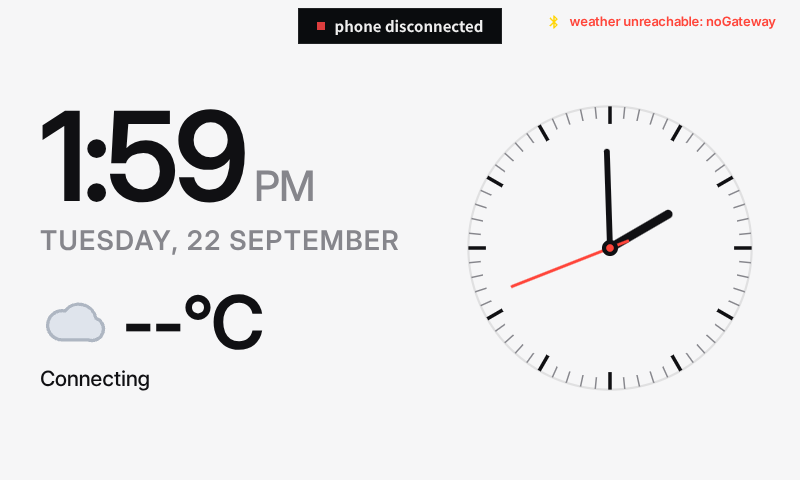
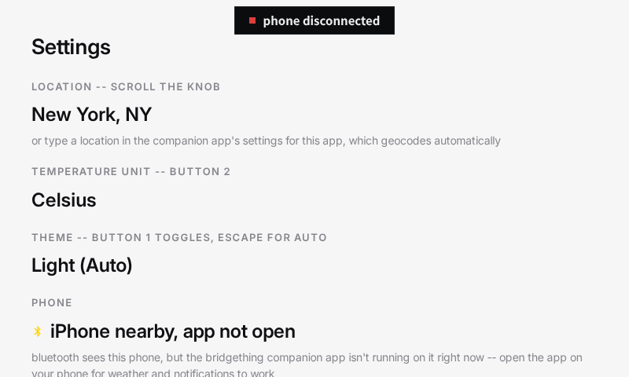
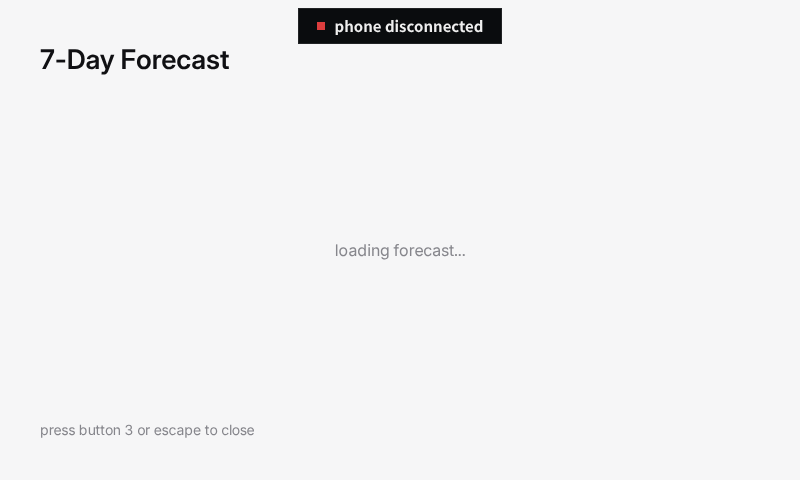

# 🌤️ WeatherThing

A clock and weather station for the [Spotify Car Thing](https://bridgething.com), built for the
[bridgething app jam](https://bridgething.com/appjam/). A big digital clock, a faithful 292px
analog clock with a sweeping second hand, current conditions and an hourly forecast from
Open‑Meteo (no Raspberry Pi needed — just a paired phone or desktop with internet), the original
multi‑tone weather icons, and an on‑device settings screen (physical button 4).

**Install:** paste this catalog URL into the bridgething companion app —
`https://nagarajan1295.github.io/BirdThing/catalog.v1.json`

| Night (auto dark) | Day (auto light) | On‑device settings |
|---|---|---|
|  |  |  |

Controls: buttons **1**/**2** force dark/light theme, **3** toggles °C/°F, **4** opens settings
(knob‑scrollable location list). Theme auto‑switches on real sunrise/sunset when left on auto.

## Dev workflow

```bash
cd bridgething
bun install
bun run dev                                  # http://localhost:5173, proxies a connected Car Thing
bun run --cwd apps/weatherthing dev:device   # push + hot-reload onto real hardware
bun run --cwd apps/weatherthing push         # build and install onto the connected device
bun run check                                # typecheck, build, bundle, validate the catalog
```

See [`../../CLAUDE.md`](../../CLAUDE.md) for the full workspace reference.
